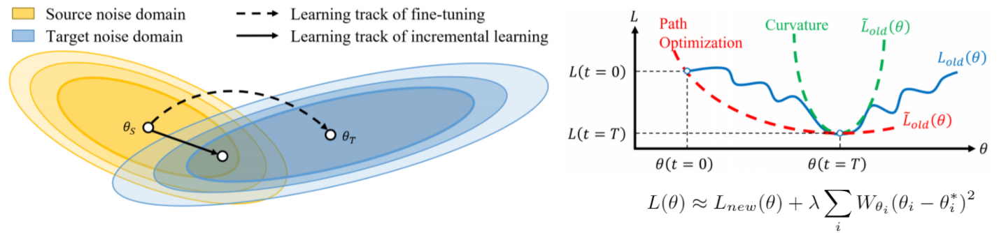

# SERIL: Noise Adaptive Speech Enhancement using Regularization based Incremental Learning - Official PyTorch Implementation
This is the original Pytorch implementation for our [paper](https://arxiv.org/abs/2005.11760). Our work focuses on building a noise adaptive speech enhancement technique with an incremental strategy to reduce catastrophic forgetting problem, complementing existing noise adaptation strategies without using additional storage.

<p>
  
</p>
  
## Contents
- [Installation](#installation)
- [Steps and Usages](#steps-and-usages)
- [Citation](#citation)
- [Contact](#contact)

## Installation
In order to install SERIL, clone the repo and install it using
pip or python :
```bash
git clone https://github.com/ChangLee0903/SERIL
cd SERIL
# Install install-required deps
pip install numpy Cython
# Install all the necessary packages
pip install -r requirements.txt
```

## Steps and Usages
1. Data Preprocess:

   You can mix your own data by using <code>adnoise</code> function in <code>util.py</code> and set the data path in <code>config/config.yaml</code>.
    - Prepare noisy wavs directory, e.g. "../train/noisy_T0/", "../dev/noisy_T0/", "../test/noisy_T0/"
    - Prepare clean wavs directory, e.g. "../train/clean_T0/", "../dev/clean_T0/", "../test/clean_T0/"
   <pre><code>train: 
    noisy:
      ['../train/noisy_T0', '../train/noisy_T1', '../train/noisy_T2', '../train/noisy_T3', '../train/noisy_T4']
    clean:
      ['../train/clean_T0', '../train/clean_T1', '../train/clean_T2', '../train/clean_T3', '../train/clean_T4']
    ...
    </code></pre>
   
   Make sure that both noisy and clean directory have the same wave file names. 
   <pre><code>../train/noisy_T0/p226_006.wav
   ../train/clean_T0/p226_006.wav
   ...</code></pre>
    

2. Train the networks for each domain sequentially:

   Note that the utterances of first domain will be taken as the training data of pretrain task which will train much longer than other domains, and both <code>--mode finetune</code> and <code>--mode seril</code> will share the same pretrain model.
    - Check log directory
    - Choose seril/naive fine-tuning mode
    - Run:
   <pre><code>python main.py --logdir log --do train --mode finetune
   python main.py --logdir log --do train --mode seril
   </code></pre>
 
3. Inference:

    Make sure your <code>--logdir log</code> setting is the same with the training step.    
    - Check log directory
    - Choose seril/naive fine-tuning mode
    - Run:
    <pre><code>python main.py --logdir log --do test --mode finetune
   python main.py --logdir log --do test --mode seril</code></pre>
    
    
## Citation
If you find the code helpful in your research, please do consider cite us!
```bash
@inproceedings{SERIL,
  author={Chi-Chang Lee, Yu-Chen Lin, Hsuan-Tien Lin, Hsin-Min Wang, Yu Tsao},
  title={{SERIL:} Noise Adaptive Speech Enhancement using Regularization-based Incremental Learning},
  year=2020,
  booktitle={Proc. Interspeech},
}
```

## Contact
Any bug report or improvement suggestion will be appreciated!
```bash
e-mail: r08922a28@csie.ntu.edu.tw
```
